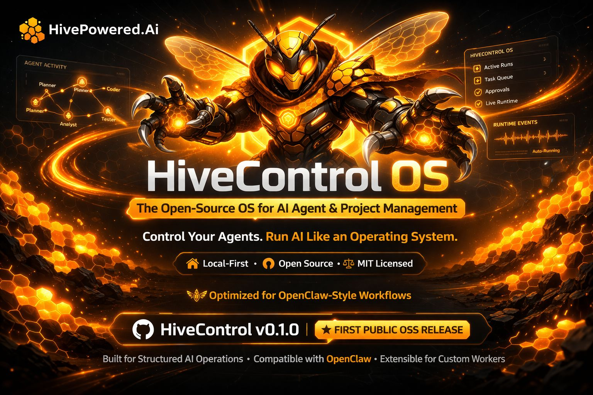

<p align="center">
  
</p>

<h1 align="center">HiveControl OS</h1>
<p align="center"><strong>The Open-Source OS for AI Agent & Project Management</strong></p>
<p align="center">
  Control your agents. Run AI like an operating system.<br/>
  A multi-agent mission control dashboard and workflow builder that plugs into <a href="https://github.com/openclaw/openclaw">OpenClaw</a>.
</p>

<p align="center">
  <a href="#quick-start">Quick Start</a> •
  <a href="#what-is-hivecontrol-os">What Is This</a> •
  <a href="#screens">Screens</a> •
  <a href="#hiveworkflow">HiveWorkflow</a> •
  <a href="#agent-swarm">Agent Swarm</a> •
  <a href="#architecture">Architecture</a> •
  <a href="#contributing">Contributing</a>
</p>

<p align="center">
  
  
  
  
</p>

---

## What Is HiveControl OS?

HiveControl OS is a **web-based mission control dashboard** that gives you real-time visibility and control over AI agent swarms running on [OpenClaw](https://openclaw.ai/).

**It is NOT a fork of OpenClaw. It does NOT include OpenClaw.** It is a standalone add-on you install into your existing OpenClaw gateway. Think of it like this:

> **OpenClaw** is the engine. **HiveControl OS** is the cockpit.

| What you get | Description |
|-------------|-------------|
| **9 live screens** | Dashboard, Tasks, Calendar, Memory, Projects, Documents, Team, Office, HiveWorkflow |
| **HiveWorkflow** | Chat with Orion (AI orchestrator) in plain English. He decomposes your request, spawns agents, and builds it — or guides you through manual steps. |
| **Hardware-aware spawning** | System profiler checks your CPU, RAM, GPU before spawning agents. Never exceeds capacity. |
| **8 specialist agents** | Pre-defined hierarchy: Orion, Atlas, Forge, Patch, Quill, Cipher, Pixel, Spark |
| **Governor mode** | API budget management so you never lose connectivity from rate limits |
| **Zero build step** | Pure HTML/CSS/JS. Open in a browser. No webpack, no React, no dependencies. |

---

## Prerequisites

- **[OpenClaw](https://openclaw.ai/)** installed and running (the gateway this plugs into)
- **Node.js** 22.14+ (or Node 24 recommended)

If you don't have OpenClaw yet:
```bash
npm i -g openclaw
openclaw onboard
```

---

## Quick Start

```bash
# 1. Clone HiveControl OS
git clone https://github.com/inspireyourbrand-dev/hivecontrol-os.git

# 2. Run the installer (copies screens into your OpenClaw gateway)
cd hivecontrol-os
bash scripts/install.sh

# 3. Start OpenClaw (if not already running)
openclaw

# 4. Open HiveControl OS in your browser
open http://localhost:18789/__hiveclaw__/hivecontrol/
```

### Manual Install (if you prefer)

```bash
# Copy the dashboard files into your OpenClaw serve directory
cp -r hivecontrol/ ~/.openclaw/hivecontrol/
cp -r hiveworkflow/ ~/.openclaw/hiveworkflow/

# Open in browser
open http://localhost:18789/__hiveclaw__/hivecontrol/
```

---

## Screens

### Dashboard
At-a-glance system health — active agents, running tasks, completions, uptime, API budget, system alerts, and a real-time activity feed.

### Tasks (Kanban)
Trello-style board with Backlog → In Progress → Review → Done columns. Drag-and-drop, priority scoring, agent assignment, bulk actions, search and filters.

### Calendar
Visualize all scheduled operations — cron jobs, heartbeats, recurring tasks. Month/week/day views. Color-coded by event type.

### Memory
Searchable journal of everything your agents remember. Day-by-day timeline, long-term durable memory, full-text search, filters by agent/type/date, pinned entries.

### Projects
Strategic project tracker with progress bars computed from linked tasks. Reverse-prompt feature: "What task moves us closest to completing this project?"

### Documents
Searchable library of everything your agents create. Grid and list views, preview panel, categorized by format.

### Team
Agent org chart showing your entire swarm. Cards for each agent with role, responsibilities, triggers, status. Mission statement. Drift checks.

### Office
Fun 2D visualization of your digital office. See agents at their desks — working, idle, or in meetings. TRON-style aesthetic with ambient effects.

### HiveWorkflow
The power screen. Chat with Orion in plain English. Describe what you want built. He decomposes it into tasks, assigns agents, checks your hardware, executes the workflow, and delivers results — or guides you step-by-step when human input is needed.

---

## HiveWorkflow

HiveWorkflow is the natural-language interface that makes AI agent swarms accessible to everyone.

**How it works:**
1. You type what you want: *"Build me a landing page for my new product"*
2. Orion decomposes it into tasks (research → design → build → content → deploy → verify)
3. The hardware monitor checks your system can handle the agent load
4. Agents execute in parallel waves within your capacity limits
5. If human input is needed (credentials, approvals, file uploads), a guided steps panel slides in
6. Results deliver back to HiveControl OS — tasks appear on the Kanban, agents show in Team/Office

**Three-panel UI:**
- **Left:** Agent swarm monitor with hardware stats and capacity ring
- **Center:** Chat with Orion + live workflow visualization
- **Right:** Dynamic steps panel (slides in when your input is needed)

See `hiveworkflow/README.md` for full technical documentation.

---

## Agent Swarm

HiveControl OS ships with 8 pre-defined specialist agents:

```
Orion (Master Orchestrator)
├── Atlas     — Infrastructure & Ops
├── Forge     — Code Generation & Builds
├── Patch     — Bug Fixing & Debugging
├── Quill     — Content & Documentation
├── Cipher    — Security & Compliance
├── Pixel     — Design & UI/UX
├── Spark     — Research & Analysis
└── [Dynamic] — HiveWorkflow-spawned specialists
```

Every agent has a defined objective, allowed scope, forbidden scope, output contract, and escalation rules. See `agents/` for full specs.

---

## Architecture

```
┌───────────────────────────────────────────────┐
│            HiveControl OS (this repo)          │
│                                                │
│  ┌────────────────────────────────────────┐   │
│  │  HiveWorkflow                          │   │
│  │  Chat → Decompose → Spawn → Execute    │   │
│  │  engine.js + hw-monitor + spawner      │   │
│  └────────────────────────────────────────┘   │
│  ┌────────────────────────────────────────┐   │
│  │  9 Dashboard Screens                   │   │
│  │  All connected via WebSocket           │   │
│  └────────────────────────────────────────┘   │
│  ┌────────────────────────────────────────┐   │
│  │  Cross-Screen Event Bus (hive-bus.js)  │   │
│  │  BroadcastChannel + postMessage        │   │
│  └────────────────────────────────────────┘   │
└──────────────────┬────────────────────────────┘
                   │ WebSocket (port 18789)
                   │
┌──────────────────┴────────────────────────────┐
│            OpenClaw Gateway (separate install)  │
│  Agent Runtime · Tools · Memory · Sessions     │
│  35+ model providers · Automation · Channels   │
└────────────────────────────────────────────────┘
```

**Key point:** OpenClaw is a separate installation. HiveControl OS connects to it via WebSocket. You install OpenClaw first, then add HiveControl OS on top.

---

## Repository Structure

```
hivecontrol-os/
├── README.md                    # You are here
├── LICENSE                      # MIT
├── package.json                 # npm metadata
├── hivecontrol.config.json      # Configuration
│
├── hivecontrol/                 # The dashboard (9 screens)
│   ├── index.html               # App shell (nav, routing, styles)
│   ├── screens/                 # Individual screen modules
│   │   ├── dashboard.html
│   │   ├── tasks.html
│   │   ├── calendar.html
│   │   ├── memory.html
│   │   ├── projects.html
│   │   ├── documents.html
│   │   ├── team.html
│   │   ├── office.html
│   │   └── workflow.html        # HiveWorkflow UI
│   └── lib/
│       ├── ws-client.js         # WebSocket client for OpenClaw gateway
│       └── hive-bus.js          # Cross-screen event bus
│
├── hiveworkflow/                # Workflow engine modules
│   ├── engine.js                # Decomposition, matching, execution
│   ├── hw-monitor.js            # Hardware profiling & capacity
│   ├── spawner.js               # Dynamic agent creation
│   └── README.md                # Technical documentation
│
├── agents/                      # Agent hierarchy definitions
│   ├── AGENTS.md                # Canonical hierarchy
│   └── [orion|atlas|forge|...].md
│
├── branding/                    # HivePowered brand assets
│   ├── hivepowered-theme.css
│   └── assets/                  # Images, logos, banners
│
├── skills/                      # OpenClaw skills
│   ├── governor-mode/
│   ├── hivecontrol-heartbeat/
│   └── third-party-vetting/
│
├── playbooks/                   # Operational playbooks
├── scripts/                     # Install, sync, build
├── docs/                        # Architecture, contributing, fork strategy
└── tasks/                       # Work tracking
```

---

## Governor Mode

API rate limits can kill your agent connectivity. Governor mode prevents this:

- Max 1 concurrent external API call
- 2-5 second delay between calls
- 3-tier backoff: 60s → 15min → full offline mode
- Always check local memory before external calls
- Auto-escalate models only when confidence demands it

---

## Contributing

See [CONTRIBUTING.md](docs/CONTRIBUTING.md) for guidelines. Key principles:

- Pure HTML/CSS/JS for screens — no build tooling
- Plan before building (3+ steps = written plan first)
- Verify before shipping (every screen must work in a browser)
- "Would a staff engineer approve this?"

---

## License

MIT — see [LICENSE](LICENSE).

---

<p align="center">
  <br/>
  <strong>Built by <a href="https://www.hivepowered.ai">HivePowered.Ai</a></strong><br/>
  <em>Control your agents. Run AI like an operating system.</em>
</p>
